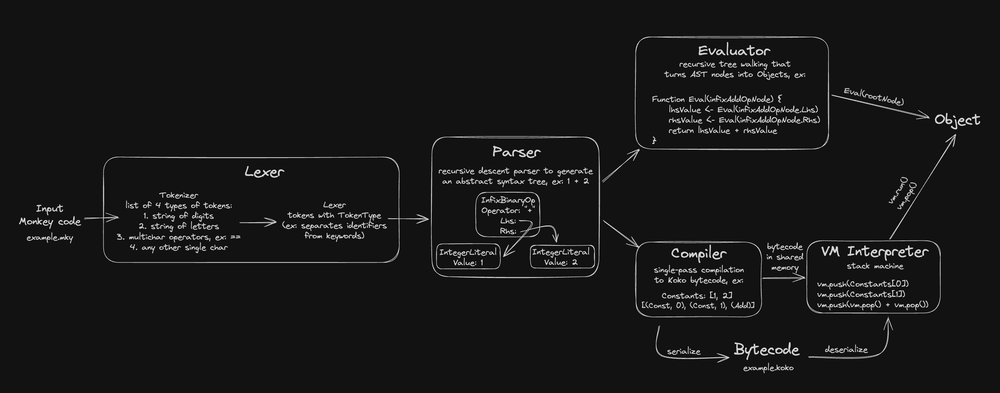

# monkey-extended 

[monkey website](https://monkeylang.org)

## Added Behavior
- `for` loops
    - `break` and `continue` control flow statements
- variable declaration without assignment (ex: `let x;`)
- variable assignment without `let` for already-defined variables (ex: `let x; x = 1;`)
- ability to set free variables within the scope of the closure
- deque methods for Array type: `push`, `pop`, `pushleft`, `popleft`
- `delete` builtin for removal from Array or Hash types
- String operators: concatenation with +, comparators (==, !=, <, >, <=, >=), indexing
- `null` literal
- bytecode (de)serialization
- support for running Monkey scripts
- support for "less/greater than or equal to" operators <=, >=

## Simplified overview diagram

